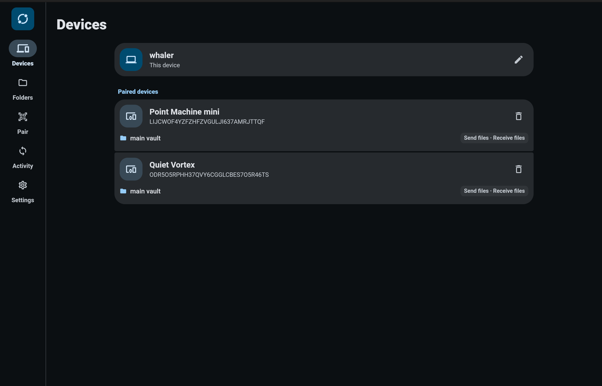

# Mesh Market

**Бессерверная синхронизация файлов — включая обнаружение пиров.**

Никакого облака. Никаких relay. Никакой инфраструктуры приложения — вообще, даже для поиска устройств.

**LAN** — устройства находят друг друга через mDNS multicast. Никакой инфраструктуры.  
**WAN** — пиры обнаруживаются через **BitTorrent Mainline DHT** по infohash, производному от секрета роя папки. SDP и ICE-кандидаты обмениваются прямо через DHT-транспорт для согласования hole-punched WebRTC data channel.  
🔒 **Каждый блок** запечатывается XChaCha20-Poly1305 до выхода с устройства. Байты файлов не проходят через DHT-узлы, STUN-серверы или любые третьи стороны.

`Flutter` · `Android` · `iOS` · `Linux` · `macOS` · `Windows`

## Что Делает Приложение

- Связывает доверенные устройства через LAN-обнаружение, QR/ручной обмен данными или общий код удаленного связывания.
- Синхронизирует папки между связанными устройствами.
- Передает измененные блоки файлов вместо повторной отправки файлов целиком.
- Обнаруживает одновременные изменения и сохраняет конфликтные копии, не перезаписывая локальные данные молча.
- Поддерживает прямой LAN-транспорт, WebRTC data channels, DHT-обнаружение пиров и резервный Bluetooth-транспорт.
- Работает в фоне на поддерживаемых платформах через платформенные сервисы или интеграцию с системным треем.

## Модель Безопасности

- Идентичность устройства основана на локальных публичных и приватных ключах.
- Подключаться могут только явно связанные устройства.
- Блоки файлов шифруются XChaCha20-Poly1305 до выхода с устройства.
- Ключи папок выводятся для каждой пары устройств через X25519 и HKDF-SHA256.
- DHT и STUN используются только для обнаружения и установления соединения. Содержимое файлов через них не передается.

## Минимальные Требования

Для запуска:

- Android: устройство, поддерживаемое Flutter, с доступом к хранилищу; функции Bluetooth требуют Bluetooth LE и runtime permissions.
- iOS: iOS 13.0 или новее.
- macOS: macOS 10.15 или новее.
- Linux: 64-битный Linux desktop с GTK, доступом к сети и правами на файловую систему для синхронизируемых папок.
- Windows: 64-битная Windows desktop, поддерживаемая Flutter.
- Сеть: доступ к локальной сети для LAN-синхронизации; интернет нужен для удаленного DHT/STUN-обнаружения.
- Хранилище: достаточно свободного места для выбранных синхронизируемых папок и локальных метаданных.

Для разработки:

- `just` 1.45.0 или новее для проектных команд.
- Flutter SDK 3.44.0 или новее.
- Dart SDK 3.12.2 или новее, ниже 4.0.0.
- Java 17 для сборок Android.
- Android Studio или Android command-line tools с Android SDK 36 для сборок Android.
- Xcode с поддержкой deployment target iOS 13.0 и macOS 10.15 для сборок iOS и macOS.
- CMake 3.14 или новее, Ninja, GTK 3 development packages, pkg-config и C++ toolchain для сборок Linux.
- Visual Studio с Desktop development with C++ и CMake 3.14 или новее для сборок Windows.

## Сборка

Установить зависимости:

```sh
flutter pub get
```

Запустить анализ:

```sh
dart analyze
```

Запустить тесты:

```sh
NO_PROXY=localhost,127.0.0.1,::1 no_proxy=localhost,127.0.0.1,::1 flutter test
```

Примеры сборки:

```sh
flutter build apk --release
flutter build linux --release
flutter build macos --release
flutter build windows --release
```

## Текущие Ограничения

- Общая WAN-синхронизация зависит от доступности пиров и условий NAT traversal.
- Фоновая работа на iOS ограничена операционной системой.
- Выбор папок на мобильных платформах ограничен системными storage API.

Подробности реализации описаны в [architecture.md](architecture.md).